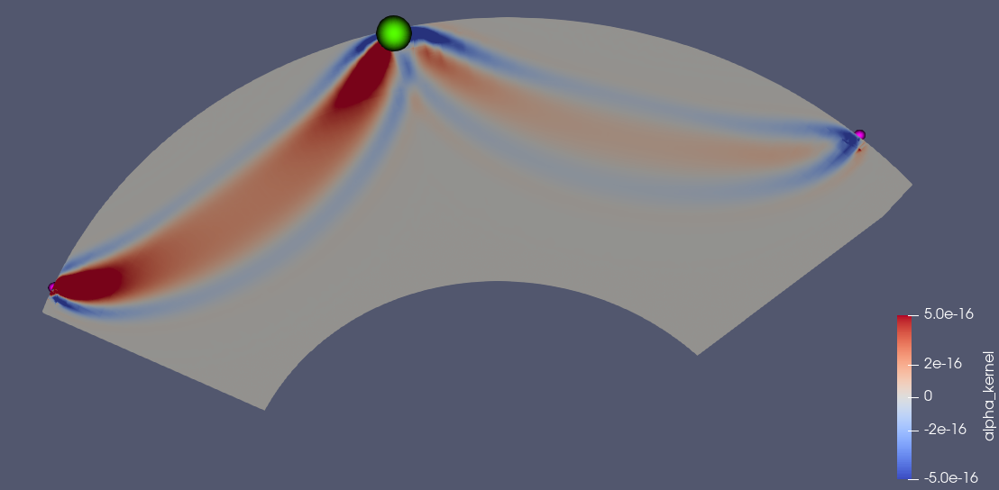

<a href="https://seisscoped.org/"></a>

# The jupyter notebook and data for the 2024 SCOPED workshop, SPECFEM3D_GLOBE session



This repository contains the jupyter notebook and data for the 2024 SCOPED workshop. Below is a brief description of the files in this repository:

- `data_processing_and_kernel_comp.ipynb`: A jupyter notebook that demonstrates how to process the data and run a kernel computation.
- `data_processing_and_kernel_comp_run_on_local.ipynb`: The same notebook as the above, but it is designed to run on local machines with docker. 
- `data`: the data for the demo, which will be downloaded in the notebook.
- `quakeml`: the QuakeML files, which will be created after running the notebook.
- `simulation`: a directory where we run forward/adjoint simulations with Specfem3D_globe. The essential files will be created here after running the notebook.
- `img`: images used in the notebook and README.md.
- `shakemov_syn`: the synthetic waveform data downloaded from the ShakeMovie website.
- `finite_fault`: the CMTSOLUTION files for the finite fault model.
- `job.jupyter`: a job script for running the jupyter notebook on Frontera.
- `job.dcv`: a job script for running the visualization job on Frontera.
- `create_slice.py`: paraview python script for creating slices.
- `AVS_boundaries_elliptical.inp`: an AVS input file for plotting the coastlies.
- `paraview_red_to_blue_colormap.json`: a paraview colormap file for plotting kernel.
- `plot_kernel_slices_frontera.pvsm`: a paraview state file for plotting kernel slices.

## About this example
This workshop material is designed for the participants who have different access to the HPC or computing resources listed below. So please follow the corresponding section below to open and run the notebook.

- A. Participants who have access to Frontera  
--> [Running this example on Frontera](#running-this-example-on-frontera)
- B. Participants who have access to the HPC/Custer with Apptainer/Singularity and compatible MPI  
--> [running the notebook on a machine other than frontera with apptainer/singularity](#running-the-notebook-on-the-machine-other-than-frontera-with-apptainersingularity)
- C. Participants who have access to the HPC/Cluster/non-small local machine with docker installed  
--> [running the notebook on the machine with docker](#running-the-notebook-on-the-machine-with-docker)  
- D. Participants who can use a local laptop  
--> [running the notebook on your local machine without wave simulation](#runnig-the-notebook-on-your-local-machine-without-wave-simulation)


## A. Running this example on Frontera

### 1. Log in to Frontera
This example is designed to run on the Frontera supercomputer at TACC. To log in to Frontera, you need to have an account at TACC and authentication setup. If you don't have an account, please follow the instruction to setup it [here](https://seisscoped.org/HPS-book/chapters/HPC/intro.html).

### 2. Run Jupyter notebook on Frontera

- go to SCRATCH directory:
```bash
cd $SCRATCH
```
- Clone this repository:
```bash
git clone https://github.com/mnagaso/workshop_scoped_2024_specfem3d_globe.git
```
- Submit the job:
```bash
cd workshop_scoped_2024_specfem3d_globe
sbatch -A EAR23006 --reservation=SCOPED_May22_3pm job.jupyter
```

- Check the job status:
```bash
squeue -u $USER
        JOBID   PARTITION   NAME      USER    ST       TIME  NODES NODELIST(REASON)
        6247768 development tap_jupy  mnagaso PD       0:00      1 (None)
```
- You will find the starting of the job by becoming `R` from `PD` for example:
```bash
squeue -u $USER
        JOBID   PARTITION   NAME      USER     ST      TIME  NODES NODELIST(REASON)
        6247768 development tap_jupy  mnagaso  R       0:00      1 c201-022
```

It takes about 1 mintue or so to finishing a initial setup. Then, you can access the jupyter notebook server by openning the link indicated at the last of the `jupyter.out` file. 

This link is something like:
```
tail jupyter.out

TACC: created reverse ports on Frontera logins
TACC: Your jupyter notebook server is now running at https://frontera.tacc.utexas.edu:60188/?token=ee7153b2ec3569dabea24b66de63247efed8cf2e8f203036cc2f490c58321fc7
```

### 3. Run the visualization job on Frontera

Stop current job for jupyter notebook by running the command below on the terminal:
``` bash
scancel -u $USER
```

Then, start a new job for the visualization by running the command below on the terminal:
``` bash
sbatch -A EAR23006 --reservation=SCOPED_May22_3pm ./job.dcv
```

After the job is started, you will have the url for opening the visualization job environment, at the end of the output file `dcvserver.out`, e.g.
```
TACC: Your DCV session is now running!
TACC: To connect to your DCV session, please point a modern web browser to:
TACC:          https://frontera.tacc.utexas.edu:60036
```

You can load the paraview module and the state file for plotting the kernel slices by running the command below on the terminal:
``` bash
./run_visualization.sh
```

## B. Running the notebook on the machine (other than Frontera) with Apptainer/Singularity

If you have an account on any other cluster than Frontera, but which 
- supports Apptainer/Singularity,
- intel mpi of v19.0.7 or close version is installed,
- and jupyter job is available,

you may run the example notebook on this cluster. Please follow the instruction below.

### 1. Prepare the apptainer/singularity image:

After `cd` to your convenient directory, clone this repository:
```bash
git clone https://github.com/mnagaso/workshop_scoped_2024_specfem3d_globe.git
```
then probably you need to load apptainer/singularity module:
```bash
module load apptainer
```
or 
```bash
module load singularity
```
then pull the docker image:
```bash
apptainer pull docker://ghcr.io/mnagaso/specfem3d_globe:centos7_mpi
```
or if you use singularity:
```bash
singularity pull docker://ghcr.io/mnagaso/specfem3d_globe:centos7_mpi
```

### 2. Prepare the prerequisites:
```bash
pip install --user obspy cartopy
```
and use the specific version of urllib3:
```bash
pip uninstall -y urllib3
pip install --user 'urllib3<2.0'
```

### 3. Launch the jupyter server on your machine:
Please submit the jupyter job on your machine, then open the notebook `data_processing_and_kernel_comp.ipynb` on the opened jupyter GUI.


## C. Running the notebook on the machine with docker
If you have a PC/cluster docker installed with sufficient RAM and disk space, you can run the notebook including forward and adjoint simulation with Specfem3D_globe on your local machine. Please follow the instruction below.

Please note that the default setup for this setup takes more than 5 hours with 4 MPI processes, so **you cannot finish the calculation within the workshop time frame**, uneless you have a powerful machine and increase the number of MPI processes.

(x86_64 architecture is required for running the docker image, as the base image is not supported on ARM architecture.)

### 1. Load the docker image
```bash
docker pull ghcr.io/mnagaso/specfem3d_globe:centos7
```
You may verify the image is downloaded by running the command below:
```bash
$ docker images
REPOSITORY                        TAG           IMAGE ID       CREATED       SIZE
ghcr.io/mnagaso/specfem3d_globe   centos7   6cab8b5522e7   3 days ago    5.55GB
```

### 2. Clone this repository:
```bash
git clone https://github.com/mnagaso/workshop_scoped_2024_specfem3d_globe.git
```

then `cd` to the cloned directory:
```bash
cd workshop_scoped_2024_specfem3d_globe
```

### 3. Launch the jupyter server on your machine:
```bash
docker run -it --rm -p 8888:8888 -v $(pwd):/home/scoped/workshop ghcr.io/mnagaso/specfem3d_globe:centos7
```
On Windows cmd, you may need to replace `$(pwd)` with `%cd%`.
On Windows PowerShell, you may need to replace `$(pwd)` with `${PWD}`.

Then, you will see the output like below:
```bash
[I 2022-05-22 06:00:00.000 JupyterHubApp] JupyterHub is now running at http://127.0.0.1:8888/lab?token=...
```
You can open the jupyter GUI by clicking the link above.

### 4. Open the notebook 
Open `workshop/data_processing_and_kernel_comp_run_with_docker.ipynb` on the opened jupyter GUI.


## D. Run the notebook on your local machine without wave simulation

If you don't have access to Frontera, you can still run the notebook on your local machine. Here is a brief instruction on how to run the notebook on your local machine:

### 1. Prepare the prerequisites:
```bash
pip install --user obspy cartopy jupyterlab
```
```bash
pip uninstall -y urllib3
pip install --user 'urllib3<2.0'
```
### 2. then launch the jupyter notebook:
```bash
jupyter-lab
or
jupyter-notebook
or
jupyter lab
or
jupyter notebook
```

then open the notebook `data_processing_and_kernel_comp_on_local.ipynb` on the opened jupyter GUI.