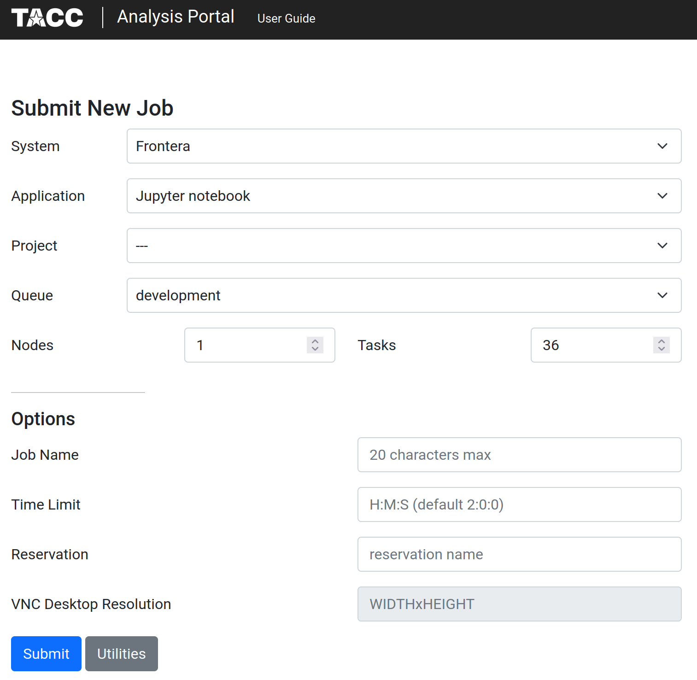
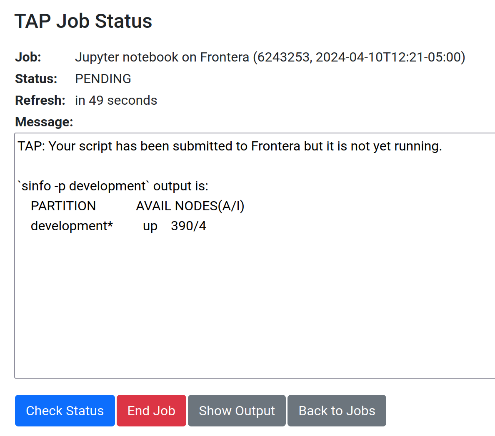

# The jupyter notebook and data for the 2024 SCOPED workshop

This repository contains the jupyter notebook and data for the 2024 SCOPED workshop. Below is a brief description of the files in this repository:

- `data_processing_and_run_fwi_demo.ipynb`: A jupyter notebook that demonstrates how to process the data and run the FWI demo.
- `data`: the data for the FWI demo, which will be downloaded after running the notebook.
- `quakeml`: the QuakeML files for the FWI, which will be created after running the notebook.
- `simulation`: a directory where we run forward/adjoint simulations with Specfem3D_globe. The essential files will be created here after running the notebook.
- `_data_backup`: backup of the observed and synthetic seismograms, and QuakeML files used in the notebook.
- `img`: images used in the notebook and README.md.

# How to run the notebook

## 1. Open a jupyter notebook session from TACC'sAnalysis Portal

- Go to the [TACC Analysis Portal](https://tap.tacc.utexas.edu/jobs/).
- Select the parameters as shown in the image below. Set:
    - System `Frontera`
    - Application `Jupyter notebook`
    - Project `**(Will we get a dedicated project id for the workshop?)**`
    - Queue `develpment **(or dedicated node for the workshop?)**`
    - Nodes `1`
    - Tasks `36`

(CURRENTLY, THE IMAGE IS FOR OUR INTERNAL TEST ONLY, AND WE WILL REPLACE IT LATER.) 



- then click the "Submit" button, then you will see the following page.



- After a few minutes, you will see the `Connect` button. Click it to open the jupyter notebook session.

- On the jupyter notebook interface, click `New` -> `Terminal` to open a terminal.
- Create a symbolic link to SCRATCH directory by:
```bash
ln -s $SCRATCH scratch
```
- Clone this repository by:
```bash
git clone (url of this repository)
```
- **go back to the aJupiter notebook interface** (switch back the browser tab)
- navigate to `scratch` -> `note_and_data_workshop` -> `data_processing_and_run_fwi_demo.ipynb` and open the notebook.
- follow the instructions in the notebook.

